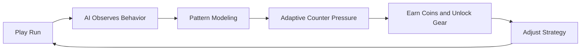

<p align="center">
  
</p>

<h1 align="center">You vs You</h1>

<p align="center">
  <strong>An adaptive AI platformer where the game learns your habits and counters them in real time.</strong><br/>
  <sub>Beat the level. Then beat your own pattern.</sub>
</p>

<p align="center">
  
  
  
  
</p>

<p align="center">
  <a href="#-quick-start"></a>
  <a href="#-gameplay-loop"></a>
  <a href="#-supabase-setup"></a>
</p>

<p align="center">
  
  
  
</p>

---

## 🎯 Why This Game Exists

Most platformers get easier once you discover the pattern.  
**You vs You** flips that: the AI finds your pattern first, then challenges it.

Instead of static levels, this game uses gameplay telemetry to adapt obstacle pressure, route targeting, and trap behavior while preserving fairness and at least one viable path.

---

## ✨ Core Highlights

<table>
  <tr>
    <td><strong>🧠 Adaptive AI Gameplay</strong><br/>Learns jump/crouch/route habits and applies behavior-based counters.</td>
    <td><strong>⚖️ Fair Adversarial Design</strong><br/>Challenges predictable play without impossible setups.</td>
  </tr>
  <tr>
    <td><strong>🏃 Level + Infinite Modes</strong><br/>Campaign progression and score-chasing survival mode.</td>
    <td><strong>🎒 Shop + Inventory</strong><br/>Unlock and manage skins, boosts, and abilities.</td>
  </tr>
  <tr>
    <td><strong>☁️ Cloud Sync</strong><br/>Supabase-backed account progress and leaderboard scoring.</td>
    <td><strong>🌐 Cross-Device Browser Play</strong><br/>Runs on phone, tablet, laptop, and desktop browsers.</td>
  </tr>
</table>

---

## 🎮 Gameplay Loop



1. **Play runs** in Level or Infinite mode  
2. **AI observes** route/movement habits  
3. **Game adapts** with targeted counters  
4. **You unlock** boosts, abilities, and skins  
5. **You evolve** strategy and push farther  

---

## 🛠️ Tech Stack

- **Frontend:** TypeScript, Vite, HTML5 Canvas
- **AI/Adaptation Runtime:** Custom telemetry + modeling + mutation systems
- **Backend Services:** Supabase Auth + Postgres tables for progress/leaderboard
- **State Persistence:** Account-linked cloud persistence for cross-device continuity

---

## 🗂️ Project Structure

```text
src/
  game.ts                # Main runtime loop, state, UI wiring
  adaptiveGenerator.ts   # Adaptive level composition + safety checks
  aiTrapDirector.ts      # Runtime trap targeting and mutation logic
  playerAnalyzer.ts      # Telemetry -> player model
  runTracker.ts          # Per-run event capture
  debugPanel.ts          # Internal diagnostics (dev use)
  renderer.ts            # Visual output
```

---

## 🚀 Quick Start

<p>
  
  
  
</p>

```bash
npm install
npm run dev
```

Open the app at the local Vite URL.

### 📦 Production Build

```bash
npx tsc --noEmit
npm run build
```

---

## 🧠 Supabase Setup

<p>
  
  
  
</p>

1. Copy `.env.example` to `.env`
2. Add `VITE_SUPABASE_URL` and `VITE_SUPABASE_ANON_KEY`
3. Run SQL setup files:
   - `supabase-migration.sql`
   - `supabase-migration-2.sql`
   - `supabase-migration-3.sql`
4. See full details in `AUTH_SETUP.md`

---

## 🏁 Submission Notes (AI Game Week)

> Built for a 7-day AI game challenge with gameplay-first AI adaptation.

- ✅ Built during the hackathon window  
- ✅ Playable on all device browsers  
- ✅ Meaningful AI integrated directly into gameplay  
- ✅ Account progress, inventory persistence, and leaderboard support  

---

## 📄 License

MIT (see `LICENSE`)